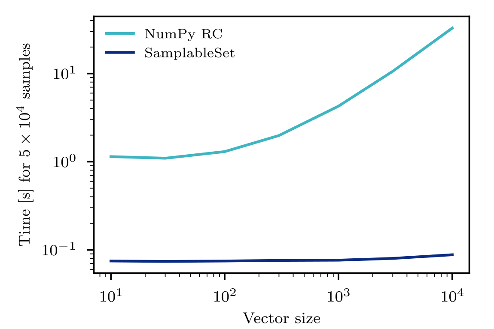

# SamplableSet

An implementation of sets that can be randomly sampled according to the weights of the elements. One only needs to specify the minimal and maximal expected weights in the set. Insertion, erase and sampling of elements are <a href="https://www.codecogs.com/eqnedit.php?latex=\mathcal{O}(\log(\log(w_\mathrm{max}/w_\mathrm{min})))" target="_blank"></a> operations in average-case, where <a href="https://www.codecogs.com/eqnedit.php?latex=w_\mathrm{max}" target="_blank"></a> and <a href="https://www.codecogs.com/eqnedit.php?latex=w_\mathrm{min}" target="_blank"></a> are the maximal and minimal weights accepted by the set respectively.
It makes use of the [pybind11](https://github.com/pybind/pybind11) project to bind C++ objects to python, making it efficient and convenient.

These sets are based on a *composition and rejection* sampling scheme.
The underlying data structure is a full binary tree with *bins* containing the
elements of the set at the leaves. The number of leaves is determined by the maximal
and minimal weights accepted. See this [paper](https://doi.org/10.1016/j.cpc.2019.02.008) for more details.

This family of classes is very useful when one needs to udpate dynamically (insertion, erase) a set of elements, as well as sample from it. This kind of situation often arise in markov chain simulations, when a collection of independant processes have multiscale propensities.

## Requirements and dependencies

* A compiler with C++17 support
* `python3`
* `pybind11` version >= 2.2

## Installation

First, clone this repository.
```bash
git clone https://github.com/gstonge/SamplableSet.git
```
Second, use pip to install the module.
```bash
pip install ./SamplableSet
```

## A peak under the hood

On the C++ side, samplable sets are created using a template class. This template accept any kind of class elements to be put in the set if a hash object exists in the standard library. Otherwise, one needs to specialize the std::hash structure.

```
├── src
    ├── hash_specialization.hpp
```
To expose a new C++ samplable set to python, one needs to bind the class to pybind.

```
├── src
    ├── bind_SamplableSetCR.hpp
```

To further wrap this new object to SamplableSet, it needs to be added to the python wrapper.

```
├── SamplableSet
    ├── _wrapper.py
```

Once this is done, the class can be used elegantly in python. Basic types are already implemented :

* `int`
* `str`

## Usage

The package offers both a C++ and a python style interface for the class in python.

### Set creation

First to create an empty samplable set, one needs to specify the minimal (maximal) weight for elements in the set, as well as the C++ type of the elements that will be inserted in the set. An non-empty set can be instanciated from an iterable of 2 iterables or a dict containing the elements and the weights.

```python
from SamplableSet import SamplableSet

# Calling the default constructor for empty samplable set
s = SamplableSet(min_weight=1, max_weight=100, cpp_type='int')

# Calling the constructor with a dict
elements_weights = {3:33.3, 6:66.6}
s = SamplableSet(1, 100, elements_weights) # cpp_type is infered from 'elements_weights'

# Calling the constructor with an iterable of pairs (elements, weights)
elements = ['a', 'b']
weights = [33.3, 66.6]
elements_weights = zip(elements, weights)
s = SamplableSet(1, 100, elements_weights) # cpp_type is infered from 'elements_weights'
```

### Basic operations : insertion, setting new weights, removing elements, etc.

```python
# Give preferential weights to elements
weight = 50
for element in range(1,101):
    s[element] = weight
    # Equivalent to s.insert(element, weight)

# Syntax to change the weight of an element is the same as insertion
# Set new weight:
s[element] = weight
# Equivalent to s.set_weight(element, weight)

# Get the weight of an element
weight = s[element]

# Remove the element
del s[element]
# Equivalent to s.erase(element)

# Get the number of elements in the set
len(s)
# Equivalent to s.size()

# Check if element is in the set
element in s

# Get the total weight sum
totat_weight = s.total_weight()
```

### Generator

The class is an iterable.

```python
for element, weight in s:
    pass
```

### Sampling

The default is sampling with replacement.

```python
# Sample one pair:
element, weight = s.sample()
# Or sample n pairs:
for element, weight in s.sample(n_samples=5):
    pass
# Note that if 'n_samples' is greater than one, sample(n_samples) actually returns a generator.
```

It is possible to sample without replacement as well. If `n_samples` is larger
than the number of elements, the generator returns `None` for the remaining
samples. It is not safe to unpack directly, unless `n_samples <= len(s)`.

```python
elements_weights = {3:33.3}
s = SamplableSet(1, 100, elements_weights)
x_list = []
for x in s.sample(n_samples=2,replace=False):
    x_list.append(x)
# x_list == [(3,33.3),None] is True
```

### Copy

There are two ways to copy a samplable set. The first one is without specifying a seed for the new RNG. In this case, the seed is obtained from the previous RNG, which is OK, except if you need to make a lot of copies of a same object--see the [Birthday problem](https://en.wikipedia.org/wiki/Birthday_problem). With the current implementation, there is a 1% chance collision for the seed if you make 9300 copies. The second method requires you to specify the seed.

```python
s = SamplableSet(1,100, [(1,33.3)])
s_copy1 = s.copy()
s_copy2 = s.copy(seed=2018)

# Copy and deepcopy are also supported, but without the seed option
from copy import copy, deepcopy
s_copy_3 = copy(s)
s_copy_4 = deepcopy(s)
# Note that copy and deepcopy are the same implementation and are in fact both deepcopies because the class is actually a wrapper.
```

## Performance test

To highlight the advantage of using `SamplableSet` in situations where you often need to change the underlying distribution, below are the results of a simple [benchmark test](test/performance.py) against `numpy.random.choice`.
It is as if we were sampling an element and updating its weight at each iteration, a situation often encountered in Markov chain simulations.



Even from a small vector of elements to sample from, there is a huge gain to use samplable `SamplableSet` since the whole cumulative distribution does not need to be computed each time. The slight increase for `SamplableSet` for large vectors is due to the initial computing of the cumulative distribution; for larger sample size this would not be noticeable.
